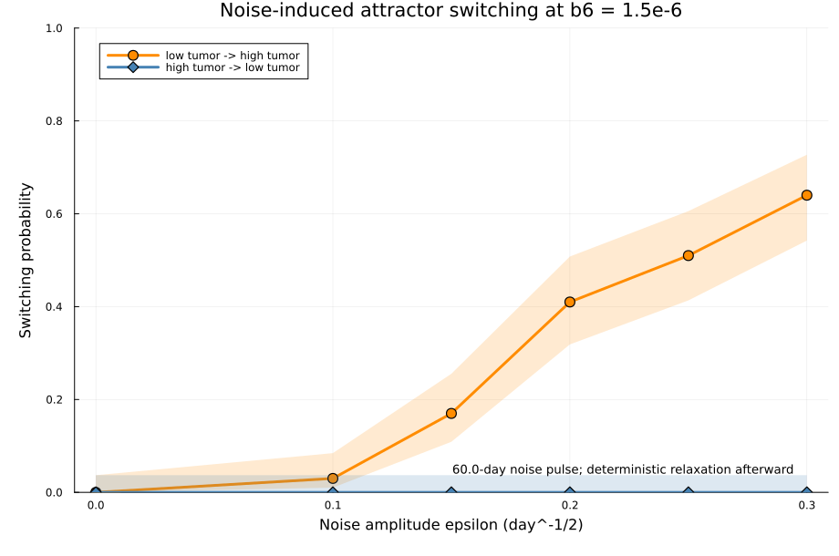
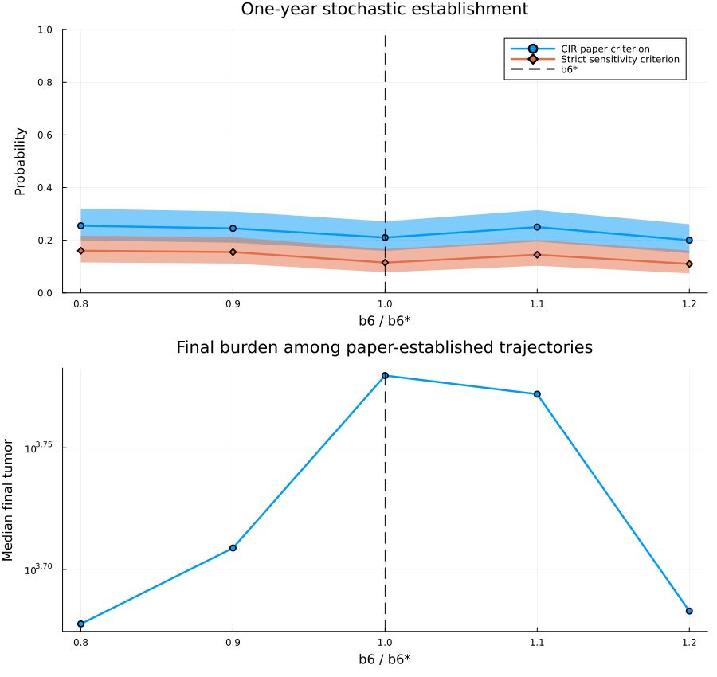

# Effector B-cell Tumor Modeling

## Reviewer quick start

For a concise explanation of the research question, model inputs, generated
datasets, computational workflow, outputs, verified findings, and
interpretation boundaries, begin with
[`docs/application_reviewer_guide.md`](docs/application_reviewer_guide.md).

This repository contains the curated computational analysis for an extended Tumor-MDSC-NK-CTL model with an effector B-cell compartment. The current research story moves from simulation-defined `b6` thresholds to equilibrium continuation, basin structure, a formal saddle-node boundary in the `b5`-`b6` plane, and a validated attractor-switching proof of concept.

It keeps the strongest representative materials from the project:

- core Julia modeling scripts
- post-meeting refinement scripts, including dense threshold sweeps, initialization robustness, `b5`-`b6` heatmaps, equilibrium/Jacobian validation, basin analysis, and formal continuation
- representative output figures and CSV summaries
- presentation builder scripts
- a small set of summary documents and PDFs

## August 2026 attractor-switching proof of concept

The latest analysis replaces the earlier two-cell establishment question with
true basin-to-basin switching. At `b6 = 1.5e-6`, trajectories begin at either
the refined low-tumor or high-tumor attractor, receive a 60-day common
multiplicative-noise pulse, and then relax deterministically for 1,500 days.
A switch is counted only when the full five-state endpoint converges to the
opposite attractor after noise is removed.

Across 100 trajectories per condition, low-to-high switching increased from
`0.03` at `epsilon = 0.10` to `0.64` at `epsilon = 0.30`. No high-to-low switch
was observed in the tested range. All 1,200 primary trajectories were valid,
all seven gates passed, and the `epsilon = 0.20` estimate was unchanged under a
finer time-step configuration.

- [`code/post_meeting/attractor_switching_poc/`](code/post_meeting/attractor_switching_poc/)
- [`results/post_meeting/attractor_switching_poc/`](results/post_meeting/attractor_switching_poc/)
- [`docs/attractor_switching_poc.md`](docs/attractor_switching_poc.md)
- [`test/attractor_switching_poc_tests.jl`](test/attractor_switching_poc_tests.jl)



## July 2026 SDE validation update

The July update now includes the validated source, tests, raw trajectory data,
summary outputs, and presentation materials:

- [`code/post_meeting/sde_validation/`](code/post_meeting/sde_validation/)
- [`results/post_meeting/sde_validation/`](results/post_meeting/sde_validation/)
- [`test/runtests.jl`](test/runtests.jl)
- [`presentations/post_meeting/sde_validation_update/Effector_B_cell_SDE_Meeting_Update.pptx`](presentations/post_meeting/sde_validation_update/Effector_B_cell_SDE_Meeting_Update.pptx)
- [`presentations/post_meeting/sde_validation_update/Effector_B_cell_SDE_Meeting_Update.pdf`](presentations/post_meeting/sde_validation_update/Effector_B_cell_SDE_Meeting_Update.pdf)

The replacement pipeline records solver status and termination reason, excludes
invalid paths, and must pass six validation gates before a pilot can run. It
reproduced the published four-state benchmark (`0.330`; published value
`0.321711`) before evaluating the five-state B-cell extension.

After invalid, prematurely terminated trajectories were removed, a
1,000-trajectory near-fold pilot produced establishment probabilities of
approximately 0.20-0.255 with overlapping confidence intervals and no monotonic
stochastic threshold. The deterministic saddle-node therefore remains the
primary result; this pilot measures two-cell establishment rather than true
attractor switching.



The full provenance and interpretation audit is in
[`docs/sde_validation_update.md`](docs/sde_validation_update.md). Earlier
stochastic outputs under `results/beta5/` and `results/beta6/` remain
preliminary and should not be used as validated evidence.

## June 2026 update

The latest presentation is [`presentations/post_meeting/june_update/June_update.pdf`](presentations/post_meeting/june_update/June_update.pdf). Its main results are:

- up/down continuation reveals history-dependent high- and low-tumor branches;
- pseudo-arclength continuation identifies coexisting equilibria;
- a simple real eigenvalue crosses zero at `b6* ~= 6.68e-7`, supporting a generic saddle-node classification;
- basin maps show that initial Tumor, NK, and B levels determine which long-time regime is reached;
- two-parameter fold continuation shows that stronger MDSC suppression (`b5`) raises the critical B-cell potency (`b6`) required for control.

The slide-to-code and slide-to-output audit is documented in [`docs/june_update_figure_provenance.md`](docs/june_update_figure_provenance.md).

## Why this repository exists

The full project workspace contains many intermediate outputs, repeated drafts, zip archives, and presentation artifacts. This package trims that down to a cleaner set of materials that still shows the scope of the work:

- model development
- parameter sweeps
- stochastic and deterministic analyses
- post-meeting refinement across dense sweeps, initialization robustness, the refined `b5 x b6` heatmap analysis, and equilibrium/Jacobian validation
- presentation-ready summaries

## Folder structure

- `code/core/`: main Julia analysis scripts covering CTL comparison, beta sweeps, parameter sweeps, and SDE refinement.
- `code/post_meeting/step1_d2/`: updated dense-sweep refinement script and associated Step 1 follow-up materials.
- `code/post_meeting/step2_initialization_d2/`: updated initialization-robustness script for the `d2` round.
- `code/post_meeting/step3_heatmap/`: refined `b5 x b6` phase-diagram script plus the follow-up plotting-fix script.
- `code/post_meeting/b6_equilibrium_jacobian/`: equilibrium-candidate refinement and finite-difference Jacobian stability screen for the `b6` continuation analysis.
- `code/post_meeting/up_down_continuation/`: up/down sweeps and the cleaned branch, hysteresis, stability, and residual plots.
- `code/post_meeting/formal_b6_continuation/`: fixed pseudo-arclength continuation workflow in `b6`.
- `code/post_meeting/zero_eigenvalue_classification/`: local Jacobian, null-mode, and saddle-node nondegeneracy diagnostics.
- `code/post_meeting/basin_of_attraction/`: coarse basin maps, summary plots, representative trajectories, and refined Tumor(0)-NK(0) boundary analysis.
- `code/post_meeting/two_parameter_fold/`: continuation of the saddle-node in the `b5`-`b6` plane.
- `code/post_meeting/sde_validation/`: validated paper-criterion regression and focused stochastic pilot around the fold.
- `code/post_meeting/attractor_switching_poc/`: equilibrium-anchored stochastic basin-switching proof of concept.
- `code/presentation_builders/`: Python scripts used to generate or assemble presentation materials.
- `results/ctl_compare/`: representative outputs from the direct-vs-coupled CTL comparison.
- `results/beta5/`: representative beta-5 deterministic and stochastic outputs.
- `results/beta6/`: representative refined beta-6 outputs and heatmap summaries.
- `results/parameter_sweeps/`: representative wide-sweep figures and CSV outputs.
- `results/post_meeting/step1_d2/`: updated Step 1 dense-sweep figures and CSV outputs.
- `results/post_meeting/step2_initialization_d2/`: updated Step 2 robustness tables, heatmaps, and supplementary state plots.
- `results/post_meeting/step3_heatmap/raw/`: original Step 3 heatmap outputs and boundary CSVs.
- `results/post_meeting/step3_heatmap/fixed/`: corrected Step 3 presentation-ready plots and cleaned boundary CSV.
- `results/post_meeting/b6_equilibrium_jacobian/`: equilibrium branch CSVs, hysteresis-gap plots, residual checks, and Jacobian stability summaries.
- `results/post_meeting/phase1_clean_branches/`: presentation-ready up/down continuation figures.
- `results/post_meeting/formal_b6_continuation/`: formal equilibrium branches, stability, residuals, and exported continuation points.
- `results/post_meeting/zero_eigenvalue_classification/`: critical equilibrium classification, eigenvalues, and local diagnostic figures.
- `results/post_meeting/basin_of_attraction/`: basin summaries, representative trajectories, and a refined control boundary.
- `results/post_meeting/two_parameter_fold/`: formal fold curve, residual checks, and numerical summaries.
- `results/post_meeting/sde_validation/`: validation gates, raw replicate data, grouped estimates, and the corrected near-fold pilot figure.
- `results/post_meeting/attractor_switching_poc/`: raw switching replicates, confidence intervals, validation gates, and representative trajectories.
- `docs/`: concise written summaries and the equation reference PDF.
- `presentations/`: slide decks, PDFs, and the final report, including the June deterministic update and July SDE validation update.

## Running the Julia analyses

Activate the repository environment before running a script:

```julia
using Pkg
Pkg.activate(".")
Pkg.instantiate()
```

The continuation scripts also use `BifurcationKit`, `ForwardDiff`, and `Accessors`; these dependencies are included in `Project.toml`.

## Notes

- This package intentionally omits zip archives, virtual environments, and a large number of duplicate outputs.
- The post-meeting materials are organized by update round so newer files replace older flat duplicates.
- The included figures and CSV files are selected for representativeness, not completeness.
- Two presentation-only composite figures could not be traced to a standalone source image or generating script in the archived workspace; they are explicitly flagged in the figure-provenance audit.
- The original preliminary SDE implementation is retained as `code/core/legacy_b6_sde_threshold_refined.jl` for audit history; validated analyses should use `code/post_meeting/sde_validation/`.
- The original full workspace remains unchanged outside this curated folder.
