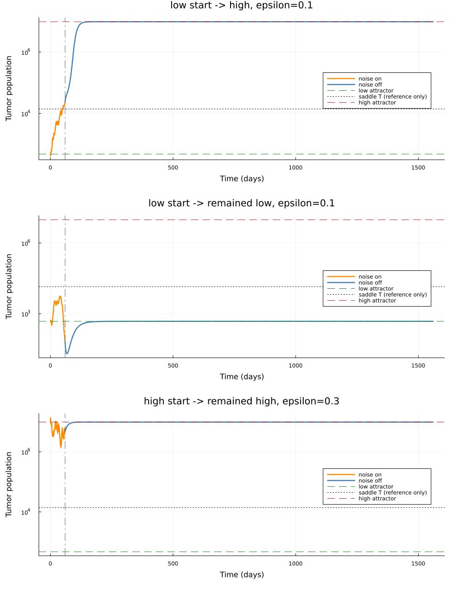

# Attractor-Switching Proof of Concept: Bilingual Explanation

## 1. Executive result | 核心结果

**English.** The proof of concept asks whether finite stochastic fluctuations
can move the five-state tumor-immune system from one deterministic basin of
attraction to the other. At `b6 = 1.5e-6`, a 60-day common multiplicative-noise
pulse produced increasingly frequent low-tumor to high-tumor transitions as
the noise amplitude increased. No high-tumor to low-tumor transition was
observed in 100 replicates at any tested amplitude.

**中文。** 这个概念验证研究的不是“两颗肿瘤细胞能不能建立”，而是：有限时间的随机波动能否把五维肿瘤-免疫系统从一个确定性吸引域推到另一个吸引域。在
`b6 = 1.5e-6` 时，施加 60 天共同乘性噪声后，低肿瘤状态向高肿瘤状态的转换概率随噪声增强而上升；在每个强度 100 次模拟中，没有观察到高肿瘤向低肿瘤的反向转换。

| Noise `epsilon` (day^-1/2) | Low -> high | 95% Wilson CI | High -> low | 95% Wilson CI |
|---:|---:|---:|---:|---:|
| 0.00 | 0/100 = 0.00 | 0.000-0.037 | 0/100 = 0.00 | 0.000-0.037 |
| 0.10 | 3/100 = 0.03 | 0.010-0.085 | 0/100 = 0.00 | 0.000-0.037 |
| 0.15 | 17/100 = 0.17 | 0.109-0.255 | 0/100 = 0.00 | 0.000-0.037 |
| 0.20 | 41/100 = 0.41 | 0.319-0.508 | 0/100 = 0.00 | 0.000-0.037 |
| 0.25 | 51/100 = 0.51 | 0.413-0.606 | 0/100 = 0.00 | 0.000-0.037 |
| 0.30 | 64/100 = 0.64 | 0.542-0.727 | 0/100 = 0.00 | 0.000-0.037 |


## 2. Why this is different from establishment | 为什么它不同于 establishment

**Establishment question.** Start from a small inoculum, such as two tumor
cells, and ask whether the tumor survives a fixed observation window.

**建立问题。** 从两颗肿瘤细胞这样的微小初值出发，问肿瘤在固定观察期内是否存活。

**Attractor-switching question.** Start from a mature long-term state and ask
whether noise can move the system into the basin of a different long-term
state. This question is directly connected to bistability, basin geometry,
saddle nodes, and tipping.

**吸引子转换问题。** 从一个已经形成的长期稳定状态出发，问随机扰动能否把系统推入另一个长期状态的吸引域。这个问题直接对应双稳态、吸引域几何、鞍结分岔和 tipping。

The earlier near-fold establishment pilot did not measure this quantity. A
trajectory that establishes from two cells is not automatically a transition
between two pre-existing attractors.

之前的 near-fold establishment pilot 并没有测量这个量。从两颗细胞成功建立，并不等于在两个已经存在的吸引子之间发生转换。

## 3. Deterministic geometry | 确定性几何结构

The experiment uses `b6 = 1.5e-6`, a parameter inside the continuation-defined
bistable region. It is a useful first proof-of-concept point because all three
equilibria are well separated and the same parameter was used in the existing
basin analysis.

本实验选择 `b6 = 1.5e-6`，它位于 continuation 确认的双稳态区域内。这个点适合作为第一轮概念验证，因为三个平衡态分离清楚，而且已有 basin analysis 也使用了这个参数，便于前后衔接。

| Equilibrium | Tumor | MDSC | NK | CTL | B | Max real eigenvalue | Unstable modes |
|---|---:|---:|---:|---:|---:|---:|---:|
| Low-tumor attractor | 473.78 | 523.69 | 225,270.33 | 163.61 | 138,180.92 | -0.03972 | 0 |
| Saddle | 13,948.41 | 1,197.42 | 157,133.24 | 1,726.63 | 71,560.79 | +0.03752 | 1 |
| High-tumor attractor | 9,721,460.69 | 486,100.96 | 718.49 | 15.80 | 205.64 | -0.09463 | 0 |

**Attractor | 吸引子.** An equilibrium is an attractor when nearby trajectories
return to it. Numerically, all Jacobian eigenvalues have negative real parts.

吸引子是附近轨迹会回到的平衡态；数值上表现为 Jacobian 的所有特征值实部都小于零。

**Saddle | 鞍点.** The middle equilibrium has one positive eigenvalue, so it
has one unstable direction. Its stable manifold forms part of the boundary
between the two basins.

中央平衡态有一个正特征值，因此有一个不稳定方向；它的稳定流形构成两个吸引域边界的一部分。

**Important boundary.** The saddle tumor coordinate `T = 13,948` is only a
visual reference. The true basin boundary lives in the five-dimensional state
space and cannot be reduced to one tumor threshold.

**重要边界。** 鞍点的肿瘤坐标 `T = 13,948` 只用于图上参考。真正的 basin boundary 位于五维状态空间，不能简化成单独一个肿瘤阈值。

## 4. Stochastic model | 随机模型

For each population `X_i`, the experiment uses

```text
dX_i = f_i(X; b6) dt + epsilon X_i dW_t.
```

`f_i` is the same deterministic drift used by continuation. `epsilon X_i dW_t`
is multiplicative Ito noise: the instantaneous fluctuation scales with the
current population size.

`f_i` 是 continuation 使用的同一个确定性漂移项。`epsilon X_i dW_t` 是乘性 Itô 噪声，表示瞬时波动幅度随当前种群数量成比例变化。

**Common Wiener process | 共同 Wiener 过程.** All five populations share the
same `W_t`. This preserves the explicitly validated stochastic semantics of
the preceding pipeline. Independent noise would be a different model and must
be presented as a separate sensitivity analysis.

五个种群共享同一个 `W_t`，这样与前面已验证的随机模型语义保持一致。若每个种群使用独立噪声，那就是另一个模型，必须单独作为 sensitivity analysis。

**Units | 单位.** Because model time is measured in days, `epsilon` has units
of `day^-1/2`. These amplitudes are numerical stress-test levels, not estimates
fitted to patient or animal time-series data.

因为模型时间单位是天，所以 `epsilon` 的单位是 `day^-1/2`。这些强度是数值压力测试水平，不是由病人或动物纵向数据拟合得到的生物学参数。

## 5. Experimental protocol | 实验步骤

1. **Refine equilibria | 精修平衡态.** Continuation points are only initial
   guesses. Newton refinement in log-scaled coordinates solves the equilibrium
   equations at the exact `b6` used by the SDE.

   Continuation 点只作为初始猜测；代码在 log-scaled coordinates 中做 Newton 精修，确保平衡态对应 SDE 使用的精确 `b6`。

2. **Verify stability | 验证稳定性.** The Jacobian is recomputed with automatic
   differentiation. The low and high equilibria must have zero unstable modes,
   and the saddle must have exactly one.

   使用自动微分重新计算 Jacobian；低、高平衡态必须没有不稳定模态，鞍点必须恰好有一个。

3. **Initialize at an attractor | 从吸引子出发.** Separate ensembles begin at
   the refined low-tumor and high-tumor attractors. This removes ambiguity from
   arbitrary initial conditions.

   两组 ensemble 分别从精修后的低肿瘤和高肿瘤吸引子出发，避免任意初值带来的解释混乱。

4. **Apply a 60-day noise pulse | 施加 60 天噪声脉冲.** The SDE is solved with
   `SOSRI`, explicit seeds, adaptive stepping, and a nonnegative domain check.

   使用 `SOSRI`、明确随机种子、自适应步长和非负域检查求解 SDE。

5. **Turn noise off | 关闭噪声.** The stochastic endpoint becomes the initial
   condition for the deterministic ODE, which is integrated for 1,500 days.

   将随机阶段终点作为确定性 ODE 初值，并继续积分 1,500 天。

6. **Classify the final basin | 判断最终吸引域.** Classification uses all five
   state variables, not only tumor burden. The root-mean-square log distance is

   ```text
   d(x, a) = sqrt((1/5) * sum_i(log10(x_i / a_i)^2)).
   ```

   分类同时使用五个状态变量，不只看肿瘤量。若放松后的状态在该距离下收敛到相反吸引子，才记为 switch。

7. **Count only committed switches | 只计算已确认转换.** A temporary excursion
   across a plotted line does not count. The trajectory must remain in the
   opposite basin after noise is removed.

   暂时越过图上的某条线不算转换；关闭噪声以后，轨迹必须确定地落入相反吸引域。



## 6. Why turn the noise off? | 为什么要关闭噪声？

With noise continuously active, a stochastic trajectory can fluctuate back and
forth and does not literally converge to a deterministic attractor. Turning off
the noise creates an operational basin-membership test: the deterministic flow
reveals which attractor owns the stochastic endpoint.

如果噪声始终开启，随机轨迹会持续来回波动，并不会严格收敛到确定性吸引子。关闭噪声相当于做一个可操作的 basin-membership test：让确定性流告诉我们随机终点属于哪个吸引域。

This is stricter than classifying by the final tumor value or by a transient
threshold crossing. It answers whether noise caused a lasting change in basin,
not merely a temporary fluctuation.

这比只看最终肿瘤值或暂时越过阈值更严格；它判断的是噪声是否造成持久的吸引域改变，而不是短暂波动。

## 7. Interpretation | 如何解释结果

**Supported conclusion | 可以支持的结论.** At this bistable parameter and under
this 60-day common-noise protocol, sufficiently strong fluctuations can move
the controlled, low-tumor state into the high-tumor basin. The observed
frequency increases across the tested noise grid.

在这个双稳态参数和 60 天共同噪声方案下，足够强的波动可以把受控的低肿瘤状态推入高肿瘤吸引域；在测试的噪声网格中，观察到的转换频率随强度上升。

**Directional asymmetry | 方向不对称.** No reverse transition was observed.
This suggests that, under the chosen parameter and perturbation, the high-tumor
state is harder to escape than the low-tumor state. It does not prove that the
reverse transition is mathematically impossible.

没有观察到反向转换，说明在当前参数和扰动方案下，高肿瘤状态比低肿瘤状态更难逃离；但这不能证明反向转换在数学上绝对不可能。

**Meaning of 0/100 | `0/100` 的含义.** The 95% Wilson upper bound is about
`0.037`. A careful statement is “no event was observed in 100 runs; probabilities
above roughly 3.7% are not supported at 95% confidence,” not “the probability
equals zero.”

严谨说法是：“100 次中没有观察到事件，95% 区间上限约为 3.7%”；不能说“真实概率严格等于零”。

## 8. Validation | 验证体系

All seven gates passed:

1. The six-gate parent SDE validation still passes and its source fingerprint
   exactly matches the current model and dependencies.
2. Three equilibria refine to residuals below `1e-9` with the expected stability.
3. Zero noise preserves both starting attractors.
4. Identical seeds reproduce identical saved paths.
5. All `1,200/1,200` primary paths are finite, nonnegative, and full-horizon.
6. All `1,200/1,200` endpoints receive an unambiguous five-state basin label.
7. At `epsilon = 0.20`, primary and finer time-step settings give the same
   switching estimate; per-seed fate agreement is `96%`.

七个 gate 全部通过：继承的 SDE 验证仍然有效；三个平衡态和稳定性正确；零噪声不换 basin；相同 seed 完全复现；1,200 条主轨迹全部有限、非负并完成时域；所有终点都能明确分类；在 `epsilon = 0.20` 的更细步长复算中，概率差为 0，逐 seed 归宿一致率为 96%。

The archived parent validation used Julia `1.12.6`; this POC used `1.12.5`.
The source fingerprint is identical and both runtimes are in the supported
Julia `1.12` series. The patch-version difference is disclosed rather than
hidden, and the new endpoint has its own time-resolution validation.

历史 parent validation 使用 Julia `1.12.6`，本 POC 使用 `1.12.5`。源码 fingerprint 完全一致，且都属于项目支持的 Julia `1.12` 系列；这个 patch 差异被明确记录，同时新 endpoint 通过了自己的时间分辨率验证。

## 9. What we cannot claim yet | 现在不能声称什么

- We cannot call `epsilon = 0.20` a biologically realistic noise level without
  longitudinal data calibration.
- We cannot infer a continuous-time transition rate from one 60-day pulse.
- We cannot conclude that high-to-low switching is impossible from 0/100 events.
- We cannot yet claim that switching probability changes with distance to the
  fold, because this first POC fixes `b6`.
- We cannot generalize common-noise results to independent cell-type noise.

- 没有纵向数据校准，不能把 `epsilon = 0.20` 称为真实生物噪声水平。
- 只做一次 60 天脉冲，不能推断连续时间 transition rate。
- 反向 0/100 不能证明反向转换绝对不可能。
- 本轮固定 `b6`，还不能声称转换概率如何随 fold 距离变化。
- 共同噪声的结论不能直接推广到每个细胞类型的独立噪声。

## 10. Recommended next experiment | 建议的下一步

The most direct follow-up is a two-dimensional map over distance from the fold
and noise amplitude:

```text
b6 / b6* x epsilon -> P(low-to-high switch).
```

This would test the tipping-point hypothesis directly: does the low-tumor basin
become easier to escape as `b6` approaches the saddle-node? A second sensitivity
axis can vary pulse duration. Independent-noise runs should remain a clearly
labeled alternative model.

最直接的下一步是绘制“距离 fold 的位置 × 噪声强度”的二维图，检验当 `b6` 接近 saddle-node 时，低肿瘤 basin 是否更容易逃离；第二个 sensitivity axis 可以改变噪声持续时间。独立噪声应继续作为明确标注的替代模型。

## 11. Meeting script | 汇报话术

### 60-second English version

> We changed the stochastic question from two-cell establishment to true
> attractor switching. At `b6 = 1.5e-6`, continuation gives a stable low-tumor
> equilibrium, a one-unstable-direction saddle, and a stable high-tumor
> equilibrium. We started separate ensembles at each attractor, applied the
> validated common multiplicative Ito noise for 60 days, then turned noise off
> and relaxed the endpoint deterministically for 1,500 days. This makes the
> classification basin-based rather than threshold-based. Low-to-high switching
> increased from 3% at epsilon 0.10 to 64% at epsilon 0.30, while we observed no
> high-to-low switches in 100 runs per level. All 1,200 trajectories were valid,
> all seven gates passed, and the epsilon 0.20 result was stable to a finer time
> step. I see this as a promising proof of concept for noise-induced loss of
> control, not yet a biologically calibrated transition rate. The next step
> would be to map switching probability against distance from the fold.

### 中文理解版

> 我们把随机问题从“两颗细胞能否建立”改成了真正的吸引子转换。在 `b6 = 1.5e-6`
> 时，continuation 给出稳定低肿瘤平衡态、一个只有一个不稳定方向的鞍点，以及稳定高肿瘤平衡态。我们分别从两个吸引子出发，施加 60 天已经验证过的共同乘性 Itô 噪声，然后关闭噪声，再做 1,500 天确定性放松，因此分类依据是最终 basin，而不是一个临时阈值。低到高转换率从 `epsilon=0.10` 的 3% 上升到 `epsilon=0.30` 的 64%；每个强度 100 次中没有观察到高到低转换。1,200 条轨迹全部有效，七个 gate 全部通过，`epsilon=0.20` 在更细时间步下结果稳定。我会把它表述为“噪声诱发失控”的有希望概念验证，而不是已经校准的生物 transition rate。下一步应研究转换概率如何随距离 fold 改变。

## 12. Likely questions and concise answers | 教授可能追问

**Why `b6 = 1.5e-6` instead of exactly at the fold? | 为什么不直接在 fold？**

For the first POC, this point has three clearly separated equilibria and an
existing deterministic basin analysis. Exactly at the fold, the low attractor
and saddle coalesce, so “switching between two well-defined attractors” becomes
numerically and conceptually less clean. The next experiment should vary the
distance to the fold.

第一轮先选三个平衡态分离清楚、已有 basin analysis 的点。恰好在 fold 上，低吸引子与鞍点合并，两个明确吸引子之间的 switching 反而不够干净；下一步再系统改变到 fold 的距离。

**Why not classify when `T` crosses the saddle value? | 为什么不看 T 是否超过鞍点？**

Because the basin boundary is five-dimensional. The saddle's tumor coordinate
is not a universal threshold. Deterministic relaxation of the full state is a
more defensible basin test.

因为 basin boundary 是五维的，鞍点的 T 坐标不是普适阈值；用完整状态做确定性放松更可靠。

**Does zero reverse switching mean recovery is impossible? | 反向为零是否表示不可能恢复？**

No. It means no reverse event was observed under this parameter, pulse length,
noise model, amplitude range, and sample size. The 95% upper bound is about 3.7%.

不是。它只表示在当前参数、脉冲长度、噪声模型、强度范围和样本量下没有观察到；95% 上限约 3.7%。

**What is the most important next result? | 下一步最重要的结果是什么？**

Estimate `P(low-to-high)` across `b6 / b6*` and `epsilon`. That directly links
stochastic escape to the saddle-node/tipping-point geometry.

计算 `P(low-to-high)` 随 `b6 / b6*` 和 `epsilon` 的二维变化，这会把随机逃逸与 saddle-node/tipping-point 几何直接连接起来。

## 13. Reproducibility files | 可复现文件

- Source module: [`AttractorSwitchingPOC.jl`](../code/post_meeting/attractor_switching_poc/AttractorSwitchingPOC.jl)
- Runner: [`run_attractor_switching_poc.jl`](../code/post_meeting/attractor_switching_poc/run_attractor_switching_poc.jl)
- Independent tests: [`attractor_switching_poc_tests.jl`](../test/attractor_switching_poc_tests.jl)
- Raw trajectories: [`switching_replicates.csv`](../results/post_meeting/attractor_switching_poc/switching_replicates.csv)
- Summary: [`switching_summary.csv`](../results/post_meeting/attractor_switching_poc/switching_summary.csv)
- Validation gates: [`validation_gates.csv`](../results/post_meeting/attractor_switching_poc/validation_gates.csv)
- Time-step sensitivity: [`time_resolution_sensitivity.csv`](../results/post_meeting/attractor_switching_poc/time_resolution_sensitivity.csv)
